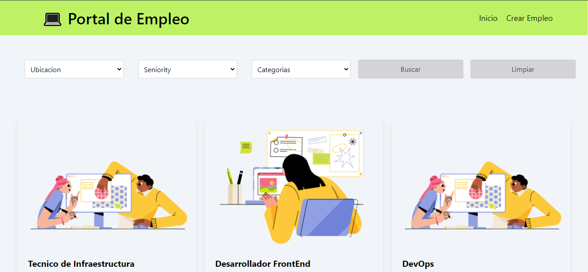

# 💻 Portal de Empleos! 

**Te invitamos a visitarnos haciendo click 🔗 [aqui](https://lumartinezz.github.io/portalDeEmpleo/)!**

## Introducción 📌
***

Portal de empleos, tercer y último trabajo del bloque de JavaScript en el curso de AdaITW!

Es un ambiente pensado para personal de rrhh donde podrán publicar las ofertas de trabajo disponibles, editar, y eliminar! Trabajamos con mockapi y asincronismo! 

Los invitamos a descubrir en profundidad de qué se trata y cómo fue ejecutado a continuación!

## Desarrollo 📌
***

- HTML5 como base del proyecto y maquetado ⚒️
- JAVASCRIPT desarrollo lógico y funcional 📚
- TAILWIND y CSS estilado  🖌️
- GITHUB herramienta para trabajar con versiones 📂	

## Funcionalidades ⚙️
***

Este proyecto cuenta con tres secciones centrales, estas son:

- Inicio
- Crear Empleo 
- Filtros

### Inicio 📌

Desde el inicio se accede inicialmente a las cards que cuentan con el título del trabajo, descripción del puesto, y tres tags que son categoría, seniority y ubicación. También tiene un botón para ver detalles, desde el cual se despliega una nueva tarjeta para leer con mayor comodidad la información; desde allí se podrá editar el empleo o bien eliminar el mismo. Aquí se aplican los métodos get y put.

### Crear Empleo 📌

Desde esta pantalla se podrá agregar una nueva oferta de empleo; Aquí se aplica el método post.

### Filtros 📌

Desde esta funcionalidad, podrán acceder a las cards cuyos tags coincidan con el filtro seleccionado para aplicar los filtros tenemos que hacerlo buscando o bien limpiando desde los botones a disposición del usuario.

*Gracias por llegar hasta acá y espero que lo disfruten!* 😊

Desarrollado con 💜 por Lucia Martinez !
